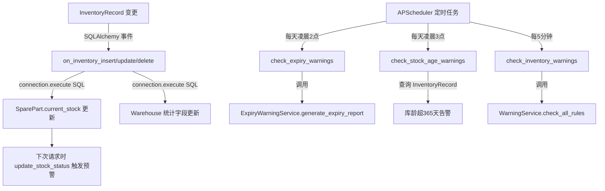

## 用户需求

按照上一轮项目诊断报告中识别的问题，对 spare_management 项目执行具体的代码修复和改进开发，数据库使用 MySQL（库名 spare_parts_db，用户名 root，密码 Kra@211314）。

## 产品概述

针对备件管理系统现有代码中的10个已确认问题，执行逐一修复，涵盖安全加固、业务逻辑补全、依赖声明修复、前端路由修正、状态管理扩展等方向，确保系统能够正常、安全、完整地运行。

## 核心修复内容

1. **安全加固**：生成强随机 SECRET_KEY，替换 .env 中的占位符
2. **依赖补全**：requirements.txt 添加 APScheduler==3.10.4
3. **循环导入修复**：scheduler.py 第11行改为从 app.extensions 导入 db，避免循环依赖
4. **库存联动事件实现**：实现 inventory.py 中3个空的 SQLAlchemy 事件监听器（after_insert/update/delete），触发备件库存数量同步和仓库统计更新
5. **定时任务补全**：实现 scheduler.py 中 check_expiry_warnings 和 check_stock_age_warnings 两个 TODO 任务，对接已有的 ExpiryWarningService
6. **User模型完善**：添加 check_password() 和 set_password() 方法，统一密码验证逻辑
7. **Warehouse事务修复**：移除 update_statistics() 中的直接 db.session.commit()，由调用方控制事务边界
8. **React路由顺序修正**：将 /warehouse/warehouses/new 路由移到 :id 动态路由之前
9. **Zustand Store扩展**：添加 warehouseListStore 和 sparePartStore，管理业务列表数据缓存，减少重复请求

## 技术栈

- **后端**：Flask 2.3.3 + SQLAlchemy 2.0 + PyMySQL，基于现有项目架构
- **调度器**：APScheduler 3.10.4（BackgroundScheduler）
- **前端**：React 18 + Vite 5 + Zustand 4 + React Router DOM 6
- **数据库**：MySQL 8（spare_parts_db，已在 .env 配置）

## 实现方案

### 整体策略

所有修改均为**最小侵入式修复**，严格基于现有代码路径，不引入新的架构模式，不重构无关代码。修复完成后项目应能直接启动运行。

### 关键技术决策

**1. SQLAlchemy 事件监听器实现策略**

`after_insert/update/delete` 事件监听器的回调参数是 `(mapper, connection, target)`，其中 `connection` 是底层数据库连接对象（非 ORM Session）。在监听器内部不能使用 `db.session.query()` 执行 ORM 查询（会导致嵌套事务问题），必须使用 `connection.execute(text(...))` 执行原生 SQL 更新备件库存总量和仓库统计。

具体逻辑：

- `after_insert`：根据 `target.spare_part_id`，用 SQL 累加 SparePart.current_stock；更新 Warehouse 统计字段
- `after_update`：通过比较新旧 quantity 的差值更新 SparePart.current_stock；触发仓库统计刷新
- `after_delete`：反向减少 SparePart.current_stock；更新仓库统计

**2. 定时任务效期预警实现**

`ExpiryWarningService` 已完整实现于 `app/services/warehouse_v3/expiry_warning_service.py`，`check_expiry_warnings` 直接调用 `ExpiryWarningService.generate_expiry_report()` 并将高优先级结果写入 Alert 表。库龄预警通过查询入库时间超阈值（默认365天）的 InventoryRecord 创建告警记录。

**3. scheduler.py 循环导入修复**

将模块级 `from app import db` 改为在函数内部延迟导入，彻底消除循环依赖：

```python
# 模块级删除：from app import db
# 在需要的函数内部：
from app.extensions import db
```

**4. Zustand Store 扩展**

添加两个业务 Store，使用 Zustand 的 `set/get` 模式，内置缓存时间戳（TTL 机制），避免同一页面内重复请求：

- `useWarehouseListStore`：缓存仓库列表、分页信息、筛选条件
- `useSparePartStore`：缓存备件列表数据和低库存统计

**5. React Router 路由顺序**

React Router v6 虽对静态路径有优先匹配，但调整顺序是最佳实践，将 `/new` 路由移到 `/:id` 前面，消除歧义。

## 实现注意事项

- **事务安全**：事件监听器使用 `connection.execute()` 绑定到当前事务，不单独 commit，随外层事务统一提交/回滚
- **Warehouse.update_statistics() 修改**：移除内部 `db.session.commit()`，但所有现有调用点需检查是否有显式 commit（现有服务层代码通常有自己的事务管理）
- **SECRET_KEY 生成**：使用 Python `secrets.token_hex(32)` 生成32字节十六进制随机串，写入 .env
- **APScheduler 版本**：指定 `APScheduler==3.10.4`，与现有 `BackgroundScheduler` API 完全兼容
- **不修改数据库结构**：所有修改均在应用层代码，不涉及 DDL 变更，不影响现有数据

## 架构设计



## 目录结构

```
修改文件清单：

d:/Trae/spare_management/
├── .env                                    # [MODIFY] 生成并替换 SECRET_KEY 为安全随机值
├── requirements.txt                        # [MODIFY] 添加 APScheduler==3.10.4
│
├── app/
│   ├── scheduler.py                        # [MODIFY] 修复循环导入；实现 check_expiry_warnings 和 check_stock_age_warnings
│   │
│   ├── models/
│   │   ├── inventory.py                    # [MODIFY] 实现3个空事件监听器（after_insert/update/delete），用原生SQL更新库存和仓库统计
│   │   ├── user.py                         # [MODIFY] 添加 check_password() 和 set_password() 方法
│   │   └── warehouse.py                    # [MODIFY] 移除 update_statistics() 中的 db.session.commit()
│   │
│   └── (其他文件不修改)
│
└── frontend/src/
    ├── App.jsx                             # [MODIFY] 调整路由顺序，/new 移到 /:id 之前
    └── stores/
        └── index.js                        # [MODIFY] 添加 useWarehouseListStore 和 useSparePartStore
```