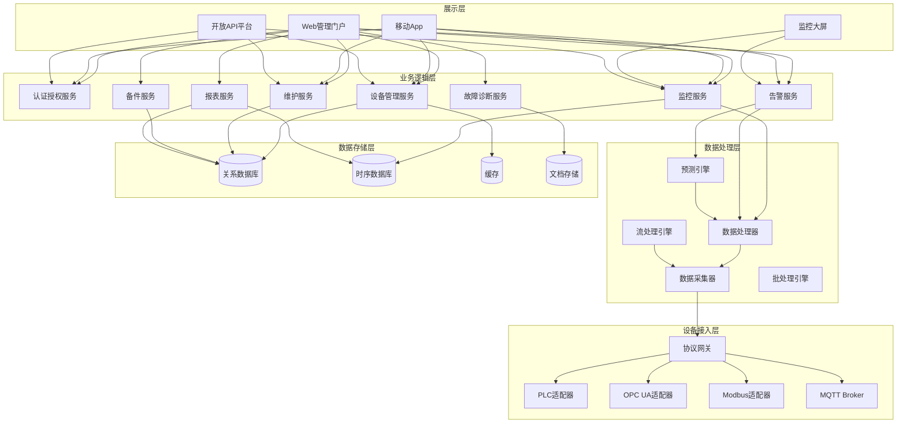

# 工业设备维护管理系统 - 系统架构设计文档

## 1. 系统总体架构

### 1.1 整体架构图



### 1.2 分层架构说明

| 层级 | 职责 | 关键组件 |
|------|------|---------|
| 展示层 | 用户交互、数据可视化 | Web门户、移动App、监控大屏、开放API |
| 业务逻辑层 | 核心业务逻辑处理 | 设备管理、监控、告警、诊断、维护等服务 |
| 数据处理层 | 数据采集、清洗、分析 | 采集器、处理器、流处理、批处理、预测引擎 |
| 设备接入层 | 设备协议转换和接入 | 协议网关、各类适配器 |
| 数据存储层 | 数据持久化存储 | MySQL、InfluxDB、Redis、MongoDB |

---

## 2. 模块详细设计

### 2.1 设备接入层

#### 2.1.1 协议网关
| 功能 | 说明 |
|------|------|
| 协议转换 | 实现工业协议与内部数据格式的转换 |
| 连接管理 | 管理设备连接状态，断线重连 |
| 负载均衡 | 支持多设备高并发接入 |

#### 2.1.2 支持的协议

| 协议 | 说明 | 适用场景 |
|------|------|---------|
| OPC UA | 开放平台通信统一架构 | 现代工业设备、数据采集 |
| Modbus TCP/RTU | Modicon总线协议 | 传统工业设备、PLC |
| Profinet | 工业以太网协议 | 西门子设备 |
| EtherNet/IP | 工业以太网协议 | 罗克韦尔设备 |
| MQTT | 消息队列遥测传输 | IoT设备、传感器网络 |

#### 2.1.3 PLC适配器

| 厂商 | 型号系列 | 支持版本 |
|------|---------|---------|
| 西门子 | S7-200/300/400/1200/1500 | TIA Portal V13+ |
| 三菱 | FX/Q/L系列 | GX Works2/3 |
| 欧姆龙 | CJ/CS/NX系列 | CX-Programmer |
| 罗克韦尔 | ControlLogix/CompactLogix | Studio 5000 |

### 2.2 数据处理层

#### 2.2.1 数据采集器
- 支持多种采集频率配置（毫秒级、秒级、分钟级）
- 数据缓存和补传机制
- 高可用性设计

#### 2.2.2 数据处理器
- 数据清洗和预处理
- 特征提取（均值、标准差、峰值、RMS等）
- 物理量转换（工程单位换算）

#### 2.2.3 流处理引擎
- 实时数据分析
- 流式告警检测
- 实时计算指标

#### 2.2.4 批处理引擎
- 历史数据聚合
- 报表数据计算
- 趋势分析

#### 2.2.5 预测引擎
- 异常检测算法
- 预测性维护模型
- 趋势预测

### 2.3 业务逻辑层

#### 2.3.1 设备管理服务
- 设备CRUD操作
- 设备分类管理
- 设备档案管理
- 设备状态管理

#### 2.3.2 监控服务
- 实时数据查询
- 数据订阅
- 设备状态监控
- 组件状态监控

#### 2.3.3 告警服务
- 告警规则管理
- 告警生成
- 告警通知
- 告警处理跟踪

#### 2.3.4 故障诊断服务
- 故障码解析
- 故障原因分析
- 解决方案推荐
- 知识库管理

#### 2.3.5 维护服务
- 维护计划管理
- 工单全流程管理
- 维护记录管理
- 统计分析

#### 2.3.6 备件服务
- 备件库存管理
- 设备备件关联
- 库存预警
- 备件使用记录

#### 2.3.7 认证授权服务
- 用户认证
- 角色权限管理
- 会话管理
- Token管理

### 2.4 数据存储层

#### 2.4.1 MySQL（关系数据库）
- 存储设备基础信息
- 存储用户、权限、工单、备件等结构化数据

#### 2.4.2 InfluxDB（时序数据库）
- 存储设备实时采集数据
- 高压缩率存储
- 高性能时序查询

#### 2.4.3 Redis（缓存）
- 缓存热点数据
- 实时订阅/发布
- 分布式锁

#### 2.4.4 MongoDB（文档存储）
- 存储故障诊断知识
- 存储非结构化数据

---

## 3. 技术选型

### 3.1 后端技术栈

| 技术组件 | 选型 | 说明 |
|---------|------|------|
| Web框架 | Flask / FastAPI | 轻量级高性能Web框架 |
| ORM框架 | SQLAlchemy | Python SQL工具包和ORM |
| WebSocket | Flask-SocketIO | 实时通信 |
| 任务调度 | APScheduler | 定时任务调度 |
| OPC UA | python-opcua | OPC UA客户端库 |
| Modbus | pymodbus | Modbus协议库 |
| PLC通信 | snap7 | 西门子PLC通信库 |
| 异步IO | asyncio | 异步编程支持 |

### 3.2 前端技术栈

| 技术组件 | 选型 | 说明 |
|---------|------|------|
| 核心框架 | Vue.js 3 | 渐进式JavaScript框架 |
| UI组件库 | Element Plus | 企业级UI组件库 |
| 图表库 | ECharts | 可视化图表库 |
| 地图 | 高德地图 | 地理位置展示 |
| WebSocket | Socket.IO | 实时通信客户端 |

### 3.3 数据库技术栈

| 数据库 | 选型 | 说明 |
|--------|------|------|
| 关系型数据库 | MySQL 8.0+ | 主数据库 |
| 时序数据库 | InfluxDB 2.0+ | 时序数据存储 |
| 缓存 | Redis 7.0+ | 缓存和消息队列 |
| 文档数据库 | MongoDB 6.0+ | 非结构化数据存储 |

### 3.4 中间件和工具

| 组件 | 选型 | 说明 |
|------|------|------|
| 消息队列 | RabbitMQ / Redis | 消息队列 |
| MQTT Broker | Mosquitto / EMQX | MQTT代理 |
| 日志收集 | ELK Stack | 日志收集和分析 |
| 监控 | Prometheus + Grafana | 系统监控 |

### 3.5 部署技术栈

| 组件 | 选型 | 说明 |
|------|------|------|
| 容器化 | Docker | 容器引擎 |
| 容器编排 | Kubernetes | 容器编排 |
| 反向代理 | Nginx | Web服务器和反向代理 |
| CI/CD | GitHub Actions / GitLab CI | 持续集成部署 |

---

## 4. 部署架构

### 4.1 单服务器部署架构

```
┌─────────────────────────────────────────────────────────┐
│                       服务器                              │
│  ┌───────────────────────────────────────────────────┐  │
│  │              Nginx (反向代理)                      │  │
│  └──────────────┬────────────────────────────────────┘  │
│                 │                                        │
│  ┌──────────────┴────────────────────────────────────┐ │
│  │              应用服务 (Flask/FastAPI)              │ │
│  └──────────────┬────────────────────────────────────┘ │
│                 │                                        │
│  ┌──────────────┼────────────────────────────────────┐ │
│  │  ┌───────────┴───────────┐  ┌──────────────────┐ │ │
│  │  │   MySQL (关系数据库)  │  │  InfluxDB (时序) │ │ │
│  │  └───────────────────────┘  └──────────────────┘ │ │
│  │  ┌───────────────────┐  ┌──────────────────────┐ │ │
│  │  │  Redis (缓存)     │  │  MongoDB (文档存储)  │ │ │
│  │  └───────────────────┘  └──────────────────────┘ │ │
│  └───────────────────────────────────────────────────┘ │
└─────────────────────────────────────────────────────────┘
```

### 4.2 集群部署架构

```
                        ┌─────────────┐
                        │  负载均衡   │
                        │ (Nginx/LB)  │
                        └──────┬──────┘
                               │
                ┌──────────────┼──────────────┐
                │              │              │
         ┌──────▼──────┐ ┌─────▼──────┐ ┌─────▼──────┐
         │ 应用服务器1  │ │ 应用服务器2 │ │ 应用服务器3 │
         └──────┬──────┘ └─────┬──────┘ └─────┬──────┘
                │              │              │
                └──────────────┼──────────────┘
                               │
         ┌─────────────────────┼─────────────────────┐
         │                     │                     │
    ┌────▼────┐          ┌─────▼─────┐        ┌─────▼─────┐
    │ MySQL主从│          │ InfluxDB  │        │ Redis集群 │
    │ (主从复制)│          │  集群     │        │  (哨兵)   │
    └─────────┘          └───────────┘        └───────────┘
```

---

## 5. 网络架构

### 5.1 网络拓扑

```
┌─────────────────────────────────────────────────────────────┐
│                        企业网络                               │
│                                                               │
│  ┌──────────────────┐      ┌──────────────────┐              │
│  │   办公区域       │      │   工业网络区      │              │
│  │  (用户访问区)    │      │   (设备区域)      │              │
│  └────────┬─────────┘      └────────┬─────────┘              │
│           │                          │                        │
│  ┌────────▼─────────┐      ┌────────▼─────────┐              │
│  │   接入交换机     │      │   工业交换机      │              │
│  └────────┬─────────┘      └────────┬─────────┘              │
│           │                          │                        │
│  ┌────────▼──────────────────────────▼──────────┐            │
│  │              防火墙                           │            │
│  └────────────────────────┬─────────────────────┘            │
│                           │                                    │
│                  ┌────────▼────────┐                          │
│                  │   核心交换机     │                          │
│                  └────────┬────────┘                          │
│                           │                                    │
│    ┌──────────────────────┼──────────────────────┐           │
│    │                      │                      │           │
│ ┌──▼──┐             ┌─────▼─────┐          ┌────▼─────┐     │
│ │ Web │             │  应用服务 │          │ 数据库  │     │
│ │  服务器           │   集群    │          │  集群   │     │
│ └─────┘             └───────────┘          └──────────┘     │
└─────────────────────────────────────────────────────────────┘
```

---

## 6. 安全架构

### 6.1 安全分层

| 层级 | 安全措施 |
|------|---------|
| 网络层 | 防火墙、网络隔离、VPN |
| 传输层 | SSL/TLS加密 |
| 应用层 | 认证、授权、防SQL注入、XSS防护 |
| 数据层 | 数据加密、访问控制、备份恢复 |

### 6.2 认证授权机制
- JWT令牌认证
- RBAC角色权限控制
- 支持LDAP/SSO集成

---

## 7. 接口设计

### 7.1 RESTful API 设计规范

| 规范 | 说明 |
|------|------|
| URL风格 | 使用资源名称，小写，连字符分隔 |
| HTTP方法 | GET查询、POST创建、PUT更新、DELETE删除 |
| 状态码 | 200成功、201创建、400参数错误、401未授权、403禁止、404不存在、500服务器错误 |
| 数据格式 | JSON |

### 7.2 主要API接口

#### 设备管理接口
- `GET /api/devices` - 获取设备列表
- `POST /api/devices` - 创建设备
- `GET /api/devices/{id}` - 获取设备详情
- `PUT /api/devices/{id}` - 更新设备
- `DELETE /api/devices/{id}` - 删除设备

#### 监控接口
- `GET /api/devices/{id}/realtime` - 获取设备实时数据
- `GET /api/devices/{id}/history` - 获取设备历史数据
- `GET /api/devices/{id}/status` - 获取设备状态

#### 告警接口
- `GET /api/alerts` - 获取告警列表
- `GET /api/alerts/{id}` - 获取告警详情
- `PUT /api/alerts/{id}/acknowledge` - 确认告警
- `PUT /api/alerts/{id}/resolve` - 处理告警

#### 工单接口
- `GET /api/work-orders` - 获取工单列表
- `POST /api/work-orders` - 创建工单
- `GET /api/work-orders/{id}` - 获取工单详情
- `PUT /api/work-orders/{id}/assign` - 派单
- `PUT /api/work-orders/{id}/complete` - 完成工单

---

## 8. 系统非功能性设计

### 8.1 高可用性设计
- 应用服务集群部署
- 数据库主从复制
- Redis哨兵模式
- 负载均衡

### 8.2 性能优化
- 数据库索引优化
- 查询缓存
- 数据分页
- 前端懒加载

### 8.3 可扩展性设计
- 微服务架构（可选）
- 水平扩展能力
- 插件化设计

---

**文档版本**: v1.0
**创建日期**: 2024-04-20
**创建者**: 系统架构团队
