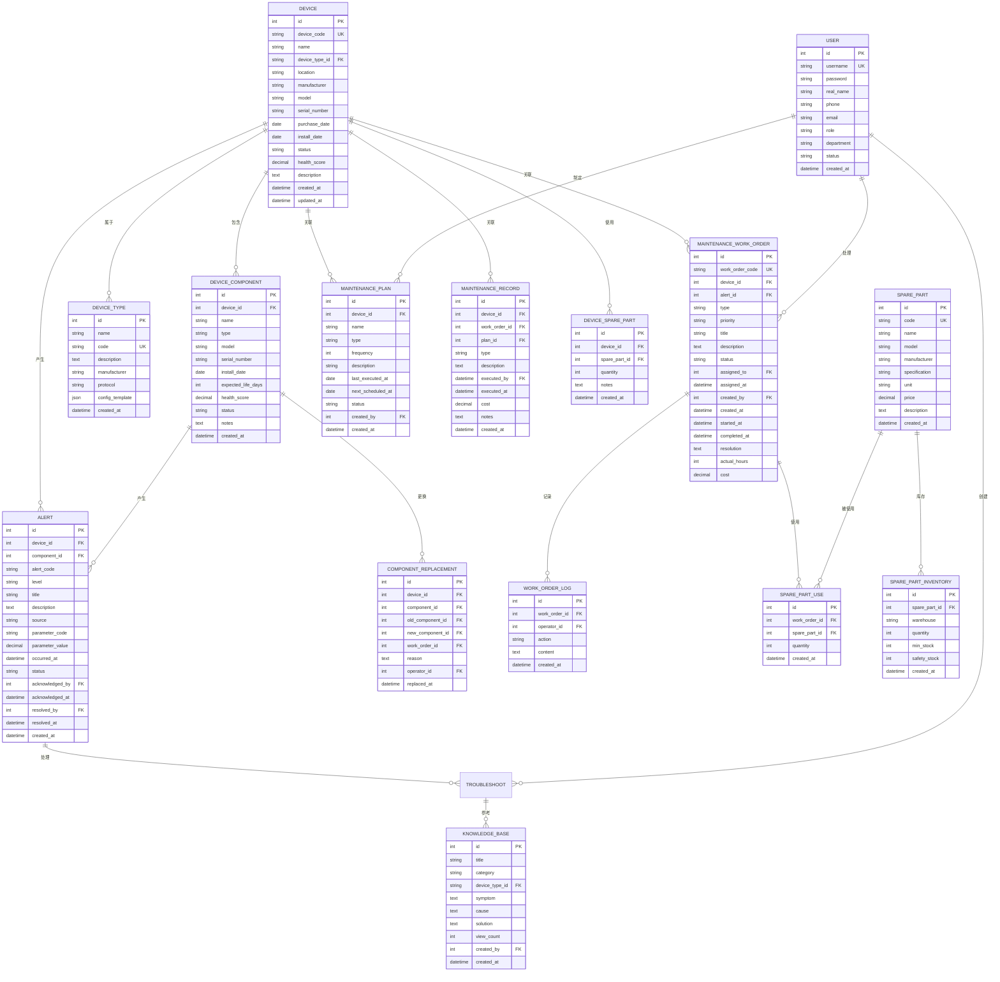

# 工业设备维护管理系统 - 数据库设计文档

## 1. 数据库总体设计

### 1.1 ER图（实体关系图）

---

## 2. 数据表详细设计

### 2.1 设备管理相关表

#### 2.1.1 设备类型表 (device_type)

| 字段名 | 类型 | 长度 | 允许NULL | 默认值 | 说明 |
|--------|------|------|---------|--------|------|
| id | INT | - | NO | AUTO_INCREMENT | 主键 |
| name | VARCHAR | 100 | NO | - | 类型名称 |
| code | VARCHAR | 50 | NO | - | 类型编码 |
| description | TEXT | - | YES | NULL | 描述 |
| manufacturer | VARCHAR | 100 | YES | NULL | 制造商 |
| protocol | VARCHAR | 50 | YES | NULL | 通信协议 |
| config_template | JSON | - | YES | NULL | 配置模板 |
| created_at | DATETIME | - | NO | CURRENT_TIMESTAMP | 创建时间 |
| updated_at | DATETIME | - | NO | CURRENT_TIMESTAMP ON UPDATE | 更新时间 |

**索引**:
- PRIMARY KEY (id)
- UNIQUE KEY uk_code (code)

---

#### 2.1.2 设备信息表 (device)

| 字段名 | 类型 | 长度 | 允许NULL | 默认值 | 说明 |
|--------|------|------|---------|--------|------|
| id | INT | - | NO | AUTO_INCREMENT | 主键 |
| device_code | VARCHAR | 50 | NO | - | 设备编码 |
| name | VARCHAR | 100 | NO | - | 设备名称 |
| device_type_id | INT | - | NO | - | 设备类型ID |
| location | VARCHAR | 200 | YES | NULL | 安装位置 |
| manufacturer | VARCHAR | 100 | YES | NULL | 制造商 |
| model | VARCHAR | 100 | YES | NULL | 型号 |
| serial_number | VARCHAR | 100 | YES | NULL | 序列号 |
| purchase_date | DATE | - | YES | NULL | 采购日期 |
| install_date | DATE | - | YES | NULL | 安装日期 |
| status | VARCHAR | 20 | NO | 'active' | 状态 |
| health_score | DECIMAL | 5,2 | YES | NULL | 健康评分(0-100) |
| description | TEXT | - | YES | NULL | 描述 |
| latitude | DECIMAL | 10,6 | YES | NULL | 纬度 |
| longitude | DECIMAL | 10,6 | YES | NULL | 经度 |
| created_at | DATETIME | - | NO | CURRENT_TIMESTAMP | 创建时间 |
| updated_at | DATETIME | - | NO | CURRENT_TIMESTAMP ON UPDATE | 更新时间 |

**索引**:
- PRIMARY KEY (id)
- UNIQUE KEY uk_device_code (device_code)
- INDEX idx_device_type (device_type_id)
- INDEX idx_status (status)

---

#### 2.1.3 设备组件表 (device_component)

| 字段名 | 类型 | 长度 | 允许NULL | 默认值 | 说明 |
|--------|------|------|---------|--------|------|
| id | INT | - | NO | AUTO_INCREMENT | 主键 |
| device_id | INT | - | NO | - | 设备ID |
| name | VARCHAR | 100 | NO | - | 组件名称 |
| type | VARCHAR | 50 | NO | - | 组件类型 |
| model | VARCHAR | 100 | YES | NULL | 型号 |
| serial_number | VARCHAR | 100 | YES | NULL | 序列号 |
| install_date | DATE | - | YES | NULL | 安装日期 |
| expected_life_days | INT | - | YES | NULL | 预期寿命(天) |
| health_score | DECIMAL | 5,2 | YES | 100.00 | 健康评分 |
| status | VARCHAR | 20 | NO | 'normal' | 状态 |
| notes | TEXT | - | YES | NULL | 备注 |
| created_at | DATETIME | - | NO | CURRENT_TIMESTAMP | 创建时间 |
| updated_at | DATETIME | - | NO | CURRENT_TIMESTAMP ON UPDATE | 更新时间 |

**索引**:
- PRIMARY KEY (id)
- INDEX idx_device_id (device_id)
- INDEX idx_status (status)

---

### 2.2 告警相关表

#### 2.2.1 告警记录表 (alert)

| 字段名 | 类型 | 长度 | 允许NULL | 默认值 | 说明 |
|--------|------|------|---------|--------|------|
| id | INT | - | NO | AUTO_INCREMENT | 主键 |
| device_id | INT | - | NO | - | 设备ID |
| component_id | INT | - | YES | NULL | 组件ID |
| alert_code | VARCHAR | 50 | NO | - | 告警编码 |
| level | VARCHAR | 20 | NO | - | 告警级别 |
| title | VARCHAR | 200 | NO | - | 告警标题 |
| description | TEXT | - | YES | NULL | 详细描述 |
| source | VARCHAR | 50 | NO | - | 告警来源 |
| parameter_code | VARCHAR | 50 | YES | NULL | 参数编码 |
| parameter_value | DECIMAL | 20,4 | YES | NULL | 参数值 |
| threshold_value | DECIMAL | 20,4 | YES | NULL | 阈值 |
| occurred_at | DATETIME | - | NO | CURRENT_TIMESTAMP | 发生时间 |
| status | VARCHAR | 20 | NO | 'active' | 状态 |
| acknowledged_by | INT | - | YES | NULL | 确认人 |
| acknowledged_at | DATETIME | - | YES | NULL | 确认时间 |
| resolved_by | INT | - | YES | NULL | 处理人 |
| resolved_at | DATETIME | - | YES | NULL | 处理时间 |
| created_at | DATETIME | - | NO | CURRENT_TIMESTAMP | 创建时间 |

**索引**:
- PRIMARY KEY (id)
- INDEX idx_device_id (device_id)
- INDEX idx_level (level)
- INDEX idx_status (status)
- INDEX idx_occurred_at (occurred_at)

---

### 2.3 维护管理相关表

#### 2.3.1 维修工单表 (maintenance_work_order)

| 字段名 | 类型 | 长度 | 允许NULL | 默认值 | 说明 |
|--------|------|------|---------|--------|------|
| id | INT | - | NO | AUTO_INCREMENT | 主键 |
| work_order_code | VARCHAR | 50 | NO | - | 工单编号 |
| device_id | INT | - | NO | - | 设备ID |
| alert_id | INT | - | YES | NULL | 关联告警ID |
| type | VARCHAR | 20 | NO | 'repair' | 类型 |
| priority | VARCHAR | 20 | NO | 'medium' | 优先级 |
| title | VARCHAR | 200 | NO | - | 标题 |
| description | TEXT | - | YES | NULL | 详细描述 |
| status | VARCHAR | 20 | NO | 'pending' | 状态 |
| assigned_to | INT | - | YES | NULL | 指派给 |
| assigned_at | DATETIME | - | YES | NULL | 指派时间 |
| created_by | INT | - | NO | - | 创建人 |
| created_at | DATETIME | - | NO | CURRENT_TIMESTAMP | 创建时间 |
| started_at | DATETIME | - | YES | NULL | 开始时间 |
| completed_at | DATETIME | - | YES | NULL | 完成时间 |
| resolution | TEXT | - | YES | NULL | 解决方案 |
| actual_hours | DECIMAL | 6,2 | YES | NULL | 实际工时 |
| cost | DECIMAL | 12,2 | YES | 0.00 | 维修费用 |
| updated_at | DATETIME | - | NO | CURRENT_TIMESTAMP ON UPDATE | 更新时间 |

**索引**:
- PRIMARY KEY (id)
- UNIQUE KEY uk_work_order_code (work_order_code)
- INDEX idx_device_id (device_id)
- INDEX idx_status (status)
- INDEX idx_priority (priority)
- INDEX idx_created_at (created_at)

---

#### 2.3.2 工单日志表 (work_order_log)

| 字段名 | 类型 | 长度 | 允许NULL | 默认值 | 说明 |
|--------|------|------|---------|--------|------|
| id | INT | - | NO | AUTO_INCREMENT | 主键 |
| work_order_id | INT | - | NO | - | 工单ID |
| operator_id | INT | - | NO | - | 操作人 |
| action | VARCHAR | 50 | NO | - | 操作类型 |
| content | TEXT | - | YES | NULL | 内容 |
| created_at | DATETIME | - | NO | CURRENT_TIMESTAMP | 创建时间 |

**索引**:
- PRIMARY KEY (id)
- INDEX idx_work_order_id (work_order_id)

---

#### 2.3.3 维护计划表 (maintenance_plan)

| 字段名 | 类型 | 长度 | 允许NULL | 默认值 | 说明 |
|--------|------|------|---------|--------|------|
| id | INT | - | NO | AUTO_INCREMENT | 主键 |
| device_id | INT | - | NO | - | 设备ID |
| name | VARCHAR | 200 | NO | - | 计划名称 |
| type | VARCHAR | 20 | NO | 'preventive' | 计划类型 |
| frequency | VARCHAR | 20 | NO | 'monthly' | 频率 |
| description | TEXT | - | YES | NULL | 描述 |
| last_executed_at | DATE | - | YES | NULL | 上次执行日期 |
| next_scheduled_at | DATE | - | YES | NULL | 下次计划日期 |
| status | VARCHAR | 20 | NO | 'active' | 状态 |
| created_by | INT | - | NO | - | 创建人 |
| created_at | DATETIME | - | NO | CURRENT_TIMESTAMP | 创建时间 |
| updated_at | DATETIME | - | NO | CURRENT_TIMESTAMP ON UPDATE | 更新时间 |

**索引**:
- PRIMARY KEY (id)
- INDEX idx_device_id (device_id)
- INDEX idx_status (status)

---

#### 2.3.4 维护记录表 (maintenance_record)

| 字段名 | 类型 | 长度 | 允许NULL | 默认值 | 说明 |
|--------|------|------|---------|--------|------|
| id | INT | - | NO | AUTO_INCREMENT | 主键 |
| device_id | INT | - | NO | - | 设备ID |
| work_order_id | INT | - | YES | NULL | 工单ID |
| plan_id | INT | - | YES | NULL | 计划ID |
| type | VARCHAR | 20 | NO | - | 类型 |
| description | TEXT | - | YES | NULL | 描述 |
| executed_by | INT | - | NO | - | 执行人 |
| executed_at | DATETIME | - | NO | CURRENT_TIMESTAMP | 执行时间 |
| cost | DECIMAL | 12,2 | YES | 0.00 | 费用 |
| notes | TEXT | - | YES | NULL | 备注 |
| created_at | DATETIME | - | NO | CURRENT_TIMESTAMP | 创建时间 |

**索引**:
- PRIMARY KEY (id)
- INDEX idx_device_id (device_id)

---

### 2.4 知识库相关表

#### 2.4.1 故障知识库表 (knowledge_base)

| 字段名 | 类型 | 长度 | 允许NULL | 默认值 | 说明 |
|--------|------|------|---------|--------|------|
| id | INT | - | NO | AUTO_INCREMENT | 主键 |
| title | VARCHAR | 200 | NO | - | 标题 |
| category | VARCHAR | 50 | NO | - | 分类 |
| device_type_id | INT | - | YES | NULL | 设备类型ID |
| symptom | TEXT | - | YES | NULL | 故障现象 |
| cause | TEXT | - | YES | NULL | 故障原因 |
| solution | TEXT | - | YES | NULL | 解决方案 |
| view_count | INT | - | YES | 0 | 浏览次数 |
| created_by | INT | - | NO | - | 创建人 |
| created_at | DATETIME | - | NO | CURRENT_TIMESTAMP | 创建时间 |
| updated_at | DATETIME | - | NO | CURRENT_TIMESTAMP ON UPDATE | 更新时间 |

**索引**:
- PRIMARY KEY (id)
- INDEX idx_category (category)
- INDEX idx_device_type_id (device_type_id)

---

### 2.5 备件管理相关表

#### 2.5.1 备件信息表 (spare_part)

| 字段名 | 类型 | 长度 | 允许NULL | 默认值 | 说明 |
|--------|------|------|---------|--------|------|
| id | INT | - | NO | AUTO_INCREMENT | 主键 |
| code | VARCHAR | 50 | NO | - | 备件编码 |
| name | VARCHAR | 100 | NO | - | 备件名称 |
| model | VARCHAR | 100 | YES | NULL | 型号 |
| manufacturer | VARCHAR | 100 | YES | NULL | 制造商 |
| specification | TEXT | - | YES | NULL | 规格 |
| unit | VARCHAR | 20 | YES | 'pcs' | 单位 |
| price | DECIMAL | 12,2 | YES | 0.00 | 单价 |
| description | TEXT | - | YES | NULL | 描述 |
| created_at | DATETIME | - | NO | CURRENT_TIMESTAMP | 创建时间 |
| updated_at | DATETIME | - | NO | CURRENT_TIMESTAMP ON UPDATE | 更新时间 |

**索引**:
- PRIMARY KEY (id)
- UNIQUE KEY uk_code (code)

---

#### 2.5.2 设备备件关联表 (device_spare_part)

| 字段名 | 类型 | 长度 | 允许NULL | 默认值 | 说明 |
|--------|------|------|---------|--------|------|
| id | INT | - | NO | AUTO_INCREMENT | 主键 |
| device_id | INT | - | NO | - | 设备ID |
| spare_part_id | INT | - | NO | - | 备件ID |
| quantity | INT | - | NO | 1 | 数量 |
| notes | TEXT | - | YES | NULL | 备注 |
| created_at | DATETIME | - | NO | CURRENT_TIMESTAMP | 创建时间 |

**索引**:
- PRIMARY KEY (id)
- UNIQUE KEY uk_device_spare (device_id, spare_part_id)

---

#### 2.5.3 备件库存表 (spare_part_inventory)

| 字段名 | 类型 | 长度 | 允许NULL | 默认值 | 说明 |
|--------|------|------|---------|--------|------|
| id | INT | - | NO | AUTO_INCREMENT | 主键 |
| spare_part_id | INT | - | NO | - | 备件ID |
| warehouse | VARCHAR | 100 | NO | - | 仓库 |
| quantity | INT | - | NO | 0 | 库存数量 |
| min_stock | INT | - | YES | 0 | 最小库存 |
| safety_stock | INT | - | YES | 0 | 安全库存 |
| created_at | DATETIME | - | NO | CURRENT_TIMESTAMP | 创建时间 |
| updated_at | DATETIME | - | NO | CURRENT_TIMESTAMP ON UPDATE | 更新时间 |

**索引**:
- PRIMARY KEY (id)
- INDEX idx_spare_part_id (spare_part_id)

---

#### 2.5.4 备件使用记录表 (spare_part_use)

| 字段名 | 类型 | 长度 | 允许NULL | 默认值 | 说明 |
|--------|------|------|---------|--------|------|
| id | INT | - | NO | AUTO_INCREMENT | 主键 |
| work_order_id | INT | - | NO | - | 工单ID |
| spare_part_id | INT | - | NO | - | 备件ID |
| quantity | INT | - | NO | 1 | 数量 |
| created_at | DATETIME | - | NO | CURRENT_TIMESTAMP | 创建时间 |

**索引**:
- PRIMARY KEY (id)
- INDEX idx_work_order_id (work_order_id)
- INDEX idx_spare_part_id (spare_part_id)

---

#### 2.5.5 组件更换记录表 (component_replacement)

| 字段名 | 类型 | 长度 | 允许NULL | 默认值 | 说明 |
|--------|------|------|---------|--------|------|
| id | INT | - | NO | AUTO_INCREMENT | 主键 |
| device_id | INT | - | NO | - | 设备ID |
| component_id | INT | - | NO | - | 组件ID |
| old_component_id | INT | - | YES | NULL | 旧组件ID |
| new_component_id | INT | - | YES | NULL | 新组件ID |
| work_order_id | INT | - | YES | NULL | 工单ID |
| reason | TEXT | - | YES | NULL | 更换原因 |
| operator_id | INT | - | NO | - | 操作人 |
| replaced_at | DATETIME | - | NO | CURRENT_TIMESTAMP | 更换时间 |

**索引**:
- PRIMARY KEY (id)
- INDEX idx_device_id (device_id)

---

### 2.6 系统管理表

#### 2.6.1 用户表 (user)

| 字段名 | 类型 | 长度 | 允许NULL | 默认值 | 说明 |
|--------|------|------|---------|--------|------|
| id | INT | - | NO | AUTO_INCREMENT | 主键 |
| username | VARCHAR | 50 | NO | - | 用户名 |
| password | VARCHAR | 255 | NO | - | 密码(加密) |
| real_name | VARCHAR | 50 | YES | NULL | 真实姓名 |
| phone | VARCHAR | 20 | YES | NULL | 电话 |
| email | VARCHAR | 100 | YES | NULL | 邮箱 |
| role | VARCHAR | 20 | NO | 'user' | 角色 |
| department | VARCHAR | 100 | YES | NULL | 部门 |
| status | VARCHAR | 20 | NO | 'active' | 状态 |
| created_at | DATETIME | - | NO | CURRENT_TIMESTAMP | 创建时间 |
| updated_at | DATETIME | - | NO | CURRENT_TIMESTAMP ON UPDATE | 更新时间 |

**索引**:
- PRIMARY KEY (id)
- UNIQUE KEY uk_username (username)
- INDEX idx_role (role)

---

## 3. 时序数据库设计 (InfluxDB)

### 3.1 测量点设计

#### 设备实时数据表 (device_realtime_data)

| Measurement | Field Key | Type | 说明 |
|-------------|----------|------|------|
| device_realtime_data | value | Float | 参数值 |

**Tags**:
- device_id: 设备ID
- device_code: 设备编码
- component_id: 组件ID
- parameter_code: 参数编码
- parameter_name: 参数名称

---

## 4. 数据库初始化脚本

详见SQL脚本位置: `database/migrations/init_industrial_equipment_system.sql

---

**文档版本**: v1.0
**创建日期**: 2024-04-20
**创建者**: 数据库设计团队
