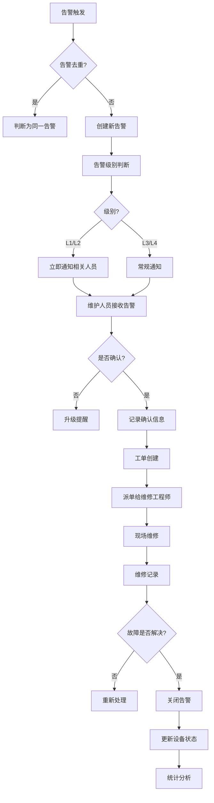
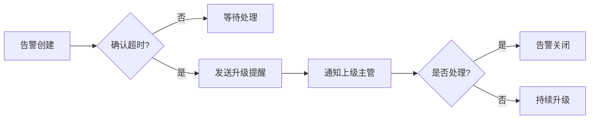

# 工业设备维护管理系统 - 告警机制设计文档

## 1. 告警级别设计

### 1.1 告警级别定义

| 级别 | 名称 | 颜色 | 说明 | 响应要求 | 通知渠道 |
|------|------|------|------|---------|---------|
| L1 | 紧急 | 🔴 红色 | 设备严重故障，可能导致生产中断或安全事故 | 5分钟内响应 | 系统通知、短信、电话、微信、邮件 |
| L2 | 重要 | 🟠 橙色 | 设备重要故障，影响正常运行 | 30分钟内响应 | 系统通知、微信、邮件 |
| L3 | 一般 | 🟡 黄色 | 设备警告信息，需要关注 | 2小时内响应 | 系统通知、邮件 |
| L4 | 提示 | 🔵 蓝色 | 一般性信息提醒 | 24小时内关注 | 仅系统通知 |

---

## 2. 告警类型设计

### 2.1 告警类型分类

| 分类 | 说明 | 示例 |
|------|------|------|
| 阈值告警 | 参数超过设定阈值 | 温度过高、电流过大 |
| 状态告警 | 设备状态变化 | 设备离线、设备停机 |
| 趋势告警 | 参数趋势异常 | 温度持续上升、振动增加 |
| 关联告警 | 多参数关联判断 | 温度高+电流大 |
| 预测告警 | 基于预测模型 | 预测将发生故障 |

---

## 3. 告警规则设计

### 3.1 阈值告警规则

#### 3.1.1 规则结构
```json
{
  "rule_id": "TEMP_HIGH_001",
  "name": "温度过高告警",
  "type": "threshold",
  "device_type": "cnc_machine",
  "parameter": "temperature",
  "operator": ">",
  "warning_value": 60,
  "danger_value": 80,
  "warning_level": "warning",
  "danger_level": "critical",
  "duration": 10,
  "enabled": true
}
```

#### 3.1.2 常用阈值规则示例

| 设备类型 | 参数 | 警告阈值 | 危险阈值 | 说明 |
|---------|------|---------|---------|------|
| 数控机床 | 主轴温度 | > 60°C | > 80°C | 主轴温度告警 |
| 数控机床 | 主轴振动 | > 5 mm/s | > 10 mm/s | 主轴振动告警 |
| PLC | 电源电压 | < 20V 或 > 26V | < 18V 或 > 28V | 电源电压告警 |
| PLC | 模块温度 | > 55°C | > 70°C | 模块温度告警 |
| 电机 | 电流 | > 额定电流的110% | > 额定电流的130% | 过流告警 |
| 液压系统 | 压力 | < 下限值 或 > 上限值 | < 下限值-10% 或 > 上限值+10% | 压力告警 |

### 3.2 趋势告警规则

#### 3.2.1 规则结构
```json
{
  "rule_id": "TREND_TEMP_RISE",
  "name": "温度持续上升告警",
  "type": "trend",
  "parameter": "temperature",
  "trend": "up",
  "change_rate": 2,
  "time_window": 300,
  "level": "warning",
  "enabled": true
}
```

#### 3.2.2 变化率判断
- 上升趋势: `(current - previous) / previous * 100 > rate`
- 下降趋势: `(current - previous) / previous * 100 < -rate`

### 3.3 组合告警规则

#### 3.3.1 规则结构
```json
{
  "rule_id": "COMBINED_RULE_001",
  "name": "温度高且电流大组合告警",
  "type": "combined",
  "logic": "AND",
  "conditions": [
    {"parameter": "temperature", "operator": ">", "value": 70},
    {"parameter": "current", "operator": ">", "value": 100}
  ],
  "level": "critical",
  "enabled": true
}
```

---

## 4. 告警处理流程

### 4.1 完整处理流程图



### 4.2 详细处理步骤

#### 步骤1: 告警触发
- 数据采集器采集到参数
- 触发条件满足
- 生成告警对象

#### 步骤2: 告警去重
- 判断是否为相同告警源
- 判断是否为相同告警类型
- 判断时间间隔是否在去重窗口内
- 如果是重复告警，则更新告警时间，不创建新告警

#### 步骤3: 告警通知
- 根据级别选择通知渠道
- 生成通知内容
- 发送通知

#### 步骤4: 告警确认
- 维护人员查看告警
- 点击确认
- 记录确认人和确认时间

#### 步骤5: 工单创建
- 从告警快速生成工单
- 自动关联设备和告警信息
- 填写工单标题和描述

#### 步骤6: 工单派单
- 指派给相关工程师
- 发送派单通知

#### 步骤7: 维修处理
- 工程师现场处理
- 记录处理过程
- 记录备件更换
- 记录维修工时

#### 步骤8: 工单验收
- 确认故障解决
- 验收工单
- 关闭相关告警

---

## 5. 告警通知机制

### 5.1 通知渠道

| 渠道 | 说明 | 支持级别 | 实现方式 |
|------|------|---------|---------|
| 系统通知 | 站内消息 | 全部 | WebSocket推送 |
| 邮件通知 | Email通知 | L1/L2/L3 | SMTP协议 |
| 短信通知 | 短信通知 | L1/L2 | SMS API |
| 微信通知 | 企业微信通知 | L1/L2/L3 | 企业微信API |
| 电话通知 | 语音电话通知 | L1 | 电话API |

### 5.2 通知内容模板

#### 5.2.1 紧急告警模板
```
【紧急告警】设备: {device_name}
告警时间: {occurred_at}
告警级别: 🔴 紧急
告警描述: {description}
请立即处理！
```

#### 5.2.2 重要告警模板
```
【重要告警】设备: {device_name}
告警时间: {occurred_at}
告警级别: 🟠 重要
告警描述: {description}
请尽快安排处理！
```

#### 5.2.3 一般告警模板
```
【一般告警】设备: {device_name}
告警时间: {occurred_at}
告警级别: 🟡 一般
告警描述: {description}
请关注！
```

### 5.3 通知人配置

| 告警级别 | 通知人 |
|---------|--------|
| L1 紧急 | 运维主管、设备管理员、相关维修工程师 |
| L2 重要 | 运维主管、相关维修工程师 |
| L3 一般 | 相关维修工程师 |
| L4 提示 | 仅系统消息 |

---

## 6. 告警升级机制

### 6.1 升级策略

| 告警级别 | 首次提醒 | 二次提醒 | 升级通知 |
|---------|---------|---------|---------|
| L1 紧急 | 立即 | 10分钟未确认 | 30分钟升级通知 |
| L2 重要 | 立即 | 30分钟未确认 | 2小时升级通知 |
| L3 一般 | 立即 | 2小时未确认 | 不升级 |
| L4 提示 | 立即 | 不提醒 | 不升级 |

### 6.2 升级流程



---

## 7. 告警统计分析

### 7.1 告警统计指标

| 指标 | 说明 |
|------|------|
| 告警总数 | 统计时间段内的告警总数 |
| 各级别告警数 | L1/L2/L3/L4告警数量 |
| 告警确认率 | 已确认告警 / 总告警 |
| 平均响应时间 | 从告警到确认的平均时间 |
| 平均解决时间 | 从告警到解决的平均时间 |
| 设备告警Top10 | 告警最多的设备 |
| 告警类型Top10 | 最常见的告警类型 |

### 7.2 告警趋势分析

| 分析维度 | 说明 |
|---------|------|
| 按时间 | 每小时/每天/每周告警趋势 |
| 按设备 | 设备告警分布 |
| 按告警类型 | 告警类型分布 |
| 按区域 | 区域告警分布 |

---

## 8. 告警知识库

### 8.1 知识库条目结构

| 字段 | 说明 |
|------|------|
| 告警代码 | 唯一标识告警的代码 |
| 告警描述 | 告警的详细描述 |
| 可能原因 | 故障的可能原因列表 |
| 处理步骤 | 推荐的处理步骤 |
| 相关备件 | 可能需要的备件 |
| 关联案例 | 历史处理案例 |

### 8.2 常见告警示例

| 告警代码 | 告警描述 | 可能原因 |
|---------|---------|---------|
| TEMP_HIGH | 主轴温度过高 | 1. 冷却系统故障<br>2. 润滑不足<br>3. 过载 |
| VIB_HIGH | 振动值过高 | 1. 轴承损坏<br>2. 动平衡差<br>3. 安装松动 |
| VOLT_LOW | 电源电压低 | 1. 电源问题<br>2. 线路压降<br>3. 过载 |
| COMM_FAIL | 通信失败 | 1. 网络问题<br>2. 设备离线<br>3. 协议错误 |

---

**文档版本**: v1.0
**创建日期**: 2024-04-20
**创建者**: 告警系统设计团队
